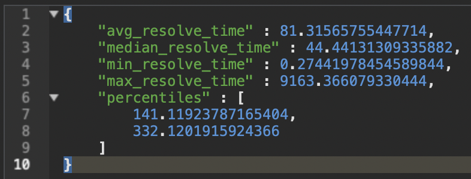

# DNS Dig API

A project to learn about DNS in Python while investigating what it's like to build an API in 2023 with [FastAPI](https://fastapi.tiangolo.com/), [Pydantic](https://pydantic-docs.helpmanual.io/) and [DNSPython](https://www.dnspython.org/). Authentication and authorization is handled by [Kinde](https://kinde.com).

## Getting Started

Python 3.11 is required to run this project. If you don't have it installed, you can use [pyenv](https://github.com/pyenv/pyenv).

Dependencies are managed by [Poetry](https://python-poetry.org/). Install Poetry and then install the dependencies.

```bash
$ curl -sSL https://install.python-poetry.org | python3.11 -
```

Now let's get the API up and running.

```bash
$ git clone git@github.com:tistaharahap/dnsdig.git
$ cd dnsdig
$ poetry install
```

Go to [Kinde](https://kinde.com) and create an account. Then create a new project and add a new API. You'll need the Client ID, Client Secret and Kinde's host for your project to run. Included with this repo is an example `.env` file.

In Kinde, add `http://localhost:8080/v1/callbacks/kinde` as a callback URL for your API.

Edit the `.env.example` file to include your Kinde credentials and rename it to `.env`.

```bash
$ vim .env.example
$ cp .env.example .env
```

The API will not run if any of the required environment variables are missing, make sure you have them all.

When everything is set, run the API.

```bash
$ chmod +x run.sh
$ ./run.sh
```

The API will be available at `http://localhost:8080` and the docs will be available at `http://localhost:8080/docs`.

Before you can make requests to the API, you'll need to create a user. Assuming that the API is running, use the API docs and go to the link below:

[http://localhost:8080/docs#/Me/get_login_url_v1_me_login_url_post](http://localhost:8080/docs#/Me/get_login_url_v1_me_login_url_post)

Click the `Try it out` button, use an empty body in `Request Body` by entering `{}` and then click the `Execute` button.

Note: If you're building a web frontend on top of this API, you can choose to use your own `state` parameter and the API provides a `store` parameter that you can use to store any data you want to be returned to your app after the user has logged in. 

In the response, you will find a `loginUrl` key, copy and paste the value to your browser. You will be redirected to Kinde's login page. After you've logged in, you will be redirected back to the API and your access token will be given in the response.

You can then use the access token to authorize yourself in the API docs. Click the `Authorize` button on the top right corner of the API docs and enter `<access_token>` in the `Value` field and click the `Authorize` button.

### Running With Docker

You can also run the API with Docker. Make sure you have Docker installed and then run the commands below.

```bash
$ docker build -t docker_username/docker_repo: latest .
$ docker run -d --name dnsdig -p 8080:8080 \
  -e WEB_CONCURRENCY=$WEB_CONCURRENCY \
  -e ENV=$ENV \
  -e MONGO_URL=$MONGO_URL \
  -e AUTH_JWKS_URL=$AUTH_JWKS_URL \
  -e AUTH_JWT_ALGO=$AUTH_JWT_ALGO \
  -e AUTH_PROVIDER_HOST=$AUTH_PROVIDER_HOST \
  -e AUTH_PROVIDER_CLIENT_ID=$AUTH_PROVIDER_CLIENT_ID \
  -e AUTH_PROVIDER_CLIENT_SECRET=$AUTH_PROVIDER_CLIENT_SECRET \
  -e AUTH_PROVIDER_REDIRECT_URI=$AUTH_PROVIDER_REDIRECT_URI \
  -e REDIS_URL=$REDIS_URL \
  -e THROTTLER_TIMES=$THROTTLER_TIMES \
  -e THROTTLER_SECONDS=$THROTTLER_SECONDS \
  -e IPINFO_HOST=$IPINFO_HOST \
  -e IPINFO_TOKEN=$IPINFO_TOKEN \
  docker_username/docker_repo:latest
````

Or if you want to get a prebuilt image, you can do the below.

```bash
$ docker run -d --name dnsdig -p 8080:8080 \
  -e WEB_CONCURRENCY=$WEB_CONCURRENCY \
  -e ENV=$ENV \
  -e MONGO_URL=$MONGO_URL \
  -e AUTH_JWKS_URL=$AUTH_JWKS_URL \
  -e AUTH_JWT_ALGO=$AUTH_JWT_ALGO \
  -e AUTH_PROVIDER_HOST=$AUTH_PROVIDER_HOST \
  -e AUTH_PROVIDER_CLIENT_ID=$AUTH_PROVIDER_CLIENT_ID \
  -e AUTH_PROVIDER_CLIENT_SECRET=$AUTH_PROVIDER_CLIENT_SECRET \
  -e AUTH_PROVIDER_REDIRECT_URI=$AUTH_PROVIDER_REDIRECT_URI \
  -e REDIS_URL=$REDIS_URL \
  -e THROTTLER_TIMES=$THROTTLER_TIMES \
  -e THROTTLER_SECONDS=$THROTTLER_SECONDS \
  -e IPINFO_HOST=$IPINFO_HOST \
  -e IPINFO_TOKEN=$IPINFO_TOKEN \
  tistaharahap/dnsdig:latest
```

### Environment Variables

| Name                          | Description                             |
|:------------------------------|:----------------------------------------|
| `WEB_CONCURRENCY`             | Optional string, defaults to 1 on macOS |
| `ENV`                         | Required string                         |
| `MONGO_URL`                   | Required string                         |
| `AUTH_JWKS_URL`               | Required string                         |
| `AUTH_JWT_ALGO`               | Required string                         |
| `AUTH_PROVIDER_HOST`          | Required string                         |
| `AUTH_PROVIDER_CLIENT_ID`     | Required string                         |
| `AUTH_PROVIDER_CLIENT_SECRET` | Required string                         |
| `AUTH_PROVIDER_REDIRECT_URI`  | Required string                         |
| `REDIS_URL`                   | Required string                         |
| `THROTTLER_TIMES`             | Required string                         |
| `THROTTLER_SECONDS`           | Required string                         |
| `IPINFO_HOST`                 | Required string                         |
| `IPINFO_TOKEN`                | Required string                         |
| `HOST`                        | Required string                         |
| `PORT`                        | Required string                         |
| `APP`                         | Fill with `dnsdigapi`                   |

## DNS Dig Daemon

Included with this repo is a small daemon that accepts UDP DNS requests, forwards them to Google's DoH (DNS over HTTPS) DNS server and then response back to the UDP client. The main goal is to have my own UDP DNS server for my network at home.

### What does it do?

I wrote this for my own use case. The bandwidth where I live in Dubai is plentiful, both for a the Fiber Optics connection at home and the 5G connection on my phone. But latency can be better IMO, I wanted to learn what's causing it.

I have a `pfsense` router at home, it protected the home network reliably but it was only rocking am Intel Atom CPU which I suppose is enough for a home network. I never saw the state table even get 1% saturated, I have no reason to believe the router is the cause for latency.

My other suspicion is DNS resolution. The TTL for most domains nowadays are usually 300 seconds, which is short enough to cause a lot of DNS requests. The `pfsense` router also acts as a DNS resolver, not a forwarder, could this be the cause?

It's a reasonable conjecture to think that this small router with passive cooling would be overwhelmed with DNS requests, not enough single core IPC performance I suspect, and not enough number of cores.

So while in the DNS topic, I wanted to do more than just think, I wanted to prove it. Long story short I wrote a Python daemon that accepts standard DNS requests, forwards them to Google's DoH and replies back to the client.

Record caching is done in redis with a TTL matching of the answer's TTL. After every reply to the client, the daemon logs the time it took to resolve the request into MongoDB. After running the daemon for a few days, here are the numbers in millisecond:



As you can see, the maximum time it took to resolve a record spiked to ~9 second at least once. The good news is that 99% of the time, the daemon was able to resolve a record in 332 ms on average. The most interesting is the minimum time which is less than 1 ms, Redis is mighty.

Subjectively speaking, I can feel the difference in latency when browsing the web. I'm not sure if it's placebo or not but I'm happy with the results.

As an added bonus, because the daemon is forwarding requests to Google's DoH, my DNS requests are secure, bad actors (ISP or otherwise) won't be able to fake any DNS responses.

The route to `dns.google` is also optimized, it took 9 hops from my machine to reach Google.

<blockquote class="twitter-tweet"><p lang="en" dir="ltr">It only took 9 hops to reach <a href="https://t.co/S7AfE22PAA">https://t.co/S7AfE22PAA</a> so I think there&#39;s another factor at play here. I&#39;m inclined to assume that since it&#39;s a TCP connection, some packets got lost in the wild. <a href="https://t.co/mx9fvTMsdr">pic.twitter.com/mx9fvTMsdr</a></p>&mdash; Batista Harahap (@tista) <a href="https://twitter.com/tista/status/1716119083303731555?ref_src=twsrc%5Etfw">October 22, 2023</a></blockquote> <script async src="https://platform.twitter.com/widgets.js" charset="utf-8"></script>

I'm going to enjoy this for a while and see if I can find any other bottlenecks in my network.

### Environment Variables

| Name        | Description         |
|:------------|:--------------------|
| `HOST`      | Optional string     |
| `PORT`      | Optional string     |
| `REDIS_URL` | Required string     |
| `MONGO_URL` | Required string     |
| `APP`       | Fill with `dnsdigd` |

### Getting Started

```bash
$ chmod +x run.sh
$ ./run.sh
```

The daemon by default will serve at `127.0.0.1:5053`.

## Why Build This?

More about it in [this blog post](https://bango29.com/building-an-api-in-2023/).
