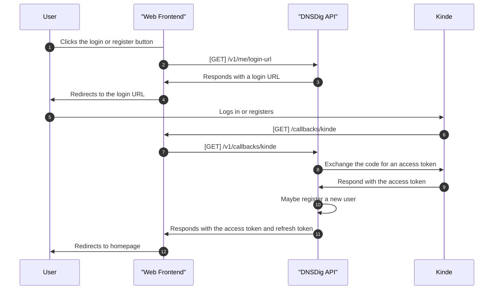
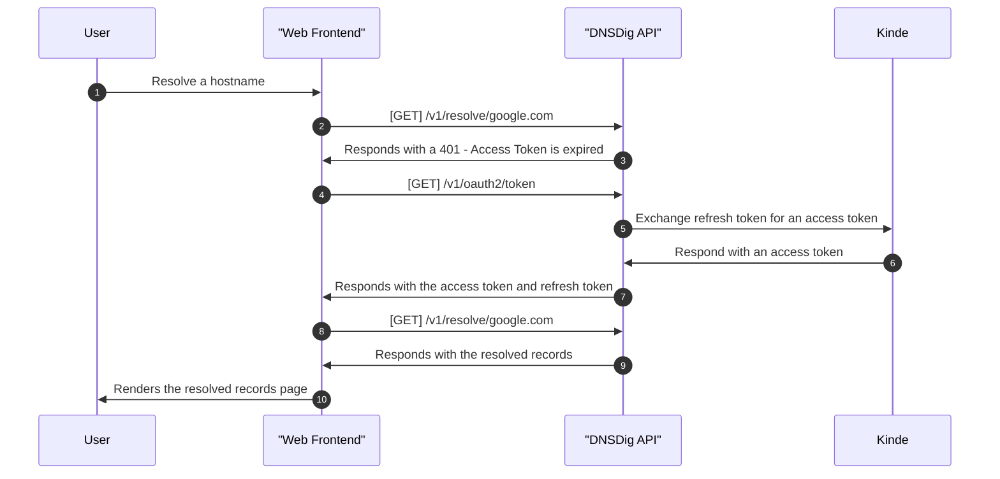
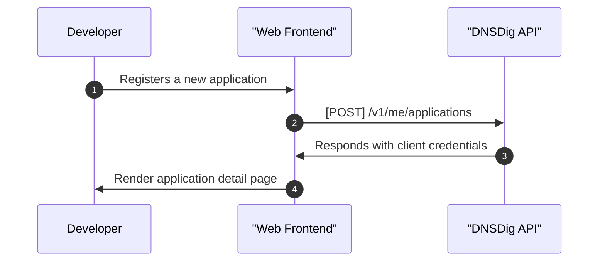
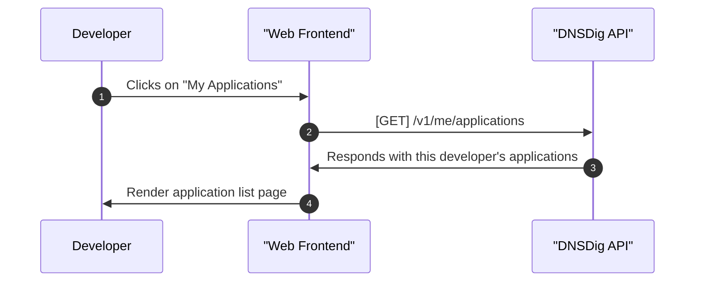
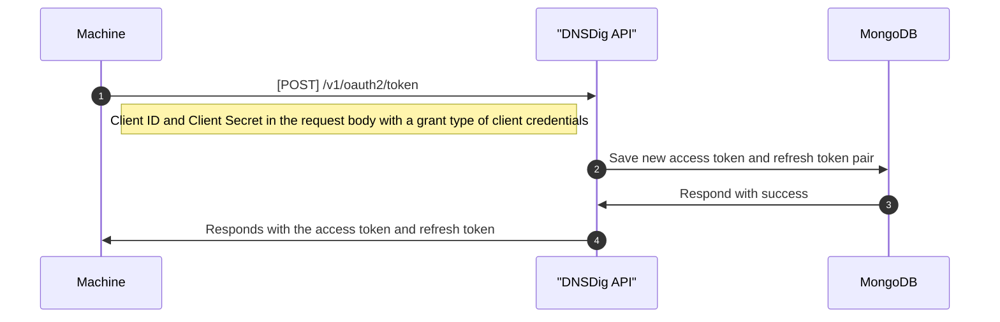
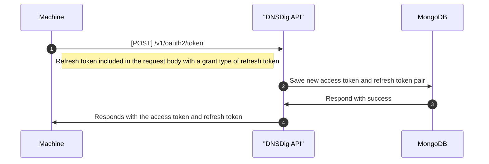

# DNSDig API

As mentioned before, DNSDig API is built on top of [FastAPI](https://fastapi.tiangolo.com/){:target="_blank"}, [Pydantic](https://pydantic-docs.helpmanual.io/){:target="_blank"} and [DNSPython](https://www.dnspython.org/){:target="_blank"}. Authentication and authorization is handled by [Kinde](https://kinde.com){:target="_blank"}. [MongoDB](https://www.mongodb.com){:target="_blank"} is the choice for the database and [Redis](https://redis.io/){:target="_blank"} is used for rate limiting so far.

This started as a hack and challenge to finish in 24 hours but I can say that it's still a work in progress. The API is deployed at [https://dnsdig-api.bango29.com](https://dnsdig-api.bango29.com){:target="_blank"} and the endpoint docs are available at [https://dnsdig-api.bango29.com/docs](https://dnsdig-api.bango29.com/docs){:target="_blank"}. The API is free to use but rate limited as described further down in this page. 

Register for an account and create an application if you want to use the API without rate limits.

## Authentication & Authorization

Kinde is responsible to issue access tokens, refresh tokens and revoke tokens. DNSDig API will only accept access tokens issued by Kinde. The access token is passed in the `Authorization` header with the `Bearer` scheme. The access tokens are issued as [JWT](https://jwt.io){:target="_blank"} tokens.

### User Flow

DNSDig API uses [OAuth 2.0](https://oauth.net/2/){:target="_blank"} to authenticate users indirectly by using Kinde. The followings are sequence diagrams of how the authentication flow works. The intended audience for this flow are humans using a web browser.

#### Login/Register Flow



#### Refresh Token Flow



### Machine to Machine Flow

Before being able to make requests to the API, a Machine to Machine (M2M) application needs to register their application first through DNSDig API's web frontend. This flow as the name implies is intended for machine to machine communication. It's not recommended to use this flow for mobile apps.

This part of the API does not use Kinde for authentication and authorization. Instead it's a custom access token and refresh token issuance that looks like an OAuth 2.0 flow. The access token is not a JWT token, it's a random string prefixed with `m2m`.

#### Register Application Flow



#### Get My Applications Flow



#### Obtain Access Token



#### Refresh Token



## Rate Limits

In DNSDig, access tokens are used for certain endpoints to avoid rate limiting. Requests that are authorized with access tokens will have an unlimited rate limit from the API's perspective than requests that are not authorized with access tokens. Rate limiting authorized requests is delegated to a reverse proxy like [nginx](https://nginx.org/en/){:target="_blank"} or [Traefik](https://traefik.io/){:target="_blank"}. DNSDig's [publicly reachable API](https://dnsdig-api.bango29.com/docs){:target="_blank"} is deployed behind Cloudflare, therefore Cloudflare's policy applies.

### Rate Limited Endpoints

The endpoints' rate limit is configurable via these environment variables:

| Name                          | Description                             |
|:------------------------------|:----------------------------------------|
| `THROTTLER_TIMES`             | Required string                         |
| `THROTTLER_SECONDS`           | Required string                         |

`THROTTLER_SECONDS` determines the number of seconds elapsed before the rate limit is reset. `THROTTLER_TIMES` determines the number of requests allowed to be made within `THROTTLER_SECONDS` seconds.

### Implementation

Rate limiting is implemented by using the [fastapi-limiter](https://github.com/long2ice/fastapi-limiter){:target="_blank"} library. In practice Redis is required to maintain the state of the rate limit. The Redis connection is configured via the `REDIS_URL` environment variable. Below is taken from a public endpoint protected with the rate limiter. The `settings` variable is a Pydantic `BaseSettings` class that is used to read environment variables and or `.env` files.

```python linenums="1"
@router.get(
    "/freesolve/{name}",
    summary="Resolve multiple DNS records - Throttled",
    tags=["Resolver", "Throttled"],
    response_model=Dict[RecordTypes, ResolverResult],
    dependencies=[Depends(RateLimiter(times=settings.throttler_times, seconds=settings.throttler_seconds))],
)
async def freesolve_dns_records(name: str, mongo_client: MongoClient = Depends(MongoClientDependency())):
    async with mongo_client.transaction():
        async with Context.public():
            # ...
```

## Raise Exceptions Anywhere

In the example endpoint written above, the mechanics of the endpoint is wrapped with an async context manager to ensure MongoDB's transactions are in effect. Therefore, whenever an exception is raised anywhere in the codebase (even by 3rd party codes in libraries), the transaction will then be rolled back, no changes are saved to MongoDB. This is particularly useful to avoid half measured database operations.

```python linenums="1"
    # ...
    @asynccontextmanager
    async def transaction(self) -> motor_asyncio.AsyncIOMotorClientSession:
        async with await self.client.start_session() as session:
            async with session.start_transaction():
                try:
                    yield session
                except Exception as exc:
                    await session.abort_transaction()
                    raise exc
    # ...

# Taken from dnsdig/libshared/models.py
```

Anywhere in the codebase, it's encouraged to raise exceptions instead of returning error responses. The exception will be caught by the exception handler and then the error response will be returned to the client. Managed exceptions are raised using FastAPI's standard exception object `HTTPException`.

```python linenums="1"
    # ...
    async def _authorize_m2m_token(self):
        query = {"token": self.access_token}
        token = await monq_find_one(model=Token, query=query, project_to=Token)
        if not token:
            raise HTTPException(status_code=401, detail="Invalid token")
        if token.token_type != TokenTypes.M2M:
            raise HTTPException(status_code=401, detail="Invalid token")
        if token.expires_at < datetime.utcnow():
            raise HTTPException(status_code=401, detail="Token expired")

        self.current_user = await User.get_user_by_app_client_id(client_id=token.owner_id)
        if self.current_user.is_blocked:
            raise HTTPException(
                status_code=403, detail="The owner of the application is blocked from using this service"
            )
    # ...

# Taken from dnsdig/libshared/context.py
```

## IPv6 Support

DNSDig API is built on top of [dnspython](https://www.dnspython.org/){:target="_blank"} in which IPv6 resolvers are supported. However, depending on your own network setup, DNSDig API might not be able to resolve records using IPv6 resolvers. For this reason, IPv6 endpoints are dedicated and ends with a `6` prefix. If your network supports IPv6 and a request is made to one of the IPv6 endpoints, the API will use IPv6 resolvers to resolve the records.

On the contrary, `AAAA` records can be resolved regardless if you use the IPv6 endpoints or the regular endpoints.

DNSDig API also have tests for IPv6 resolvers but as of now commented from the source code. This is because Github's workflow runners does not support IPv6. If this changes then the tests will be uncommented.

## IP Geolocation

DNSDig API uses [ipinfo.io](https://ipinfo.io){:target="_blank"} to geolocate IP addresses. The API is rate limited to 50,000 requests per month. The API is free to use but you need to register for an account to get an API key. When this quota is used up, DNSDig API will not include geolocation data in the response.
