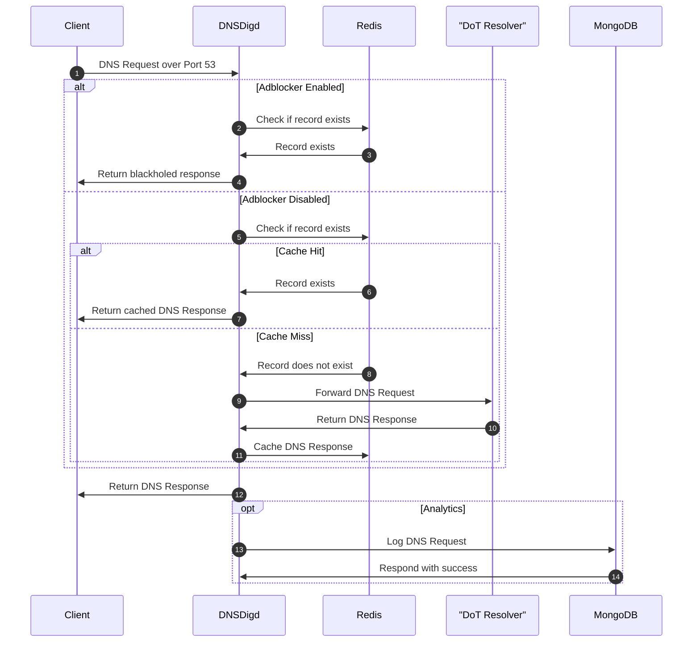

# DNSDigd

After completing the API, I was thinking more about having my own DNS daemon that would serve my home network. Where I live, we only have 2 ISPs nationwide, competition is not really a thing. So I wanted to learn more why my DNS requests are resolving quite slow. 

I have a fiber connection terminating at the ONT at home which is then fed to a [pfsense](https://www.pfsense.org/) box. I always thought my pfsense box is limited in computing power but when I see the state table, it's not even reaching 1% of usage.

While I'm at it, I want to log query times so I can have a sense of what's going on with the requests. DNS query responses are also cached to a Redis instance with their corresponding TTL.

## Resolvers

As stated in the API docs, I'm using [dnspython](https://www.dnspython.org/) to do the heavy lifting for DNS requests and responses. I haven't had enough time spent with it to have a stronger opinion but I have no complaints, so far whatever my needs are it's been able to fulfill them.

Out of the box, dnspython supports many kinds of resolvers. At first I stuck with DNS over HTTPS for about 2 weeks. However, HTTPS connections are by design uses TCP as the protocol. I have an assumption in my head that packets are getting lost in the wild, I saw query times up to 9 seconds which is unacceptable by any standard.

The slower your DNS responses are, the slower you feel browsing the interwebs. No it's not a placebo, there are plenty of loaders to convince you otherwise.

The MongoDB query to generate analytics numbers is below, all numbers are in milliseconds.

```mongoshell linenums="1"
db.getCollection("analytics").aggregate([
    {
        "$match": {
            "created_at": {
                "$gte": ISODate("2023-10-18T12:00:00Z"), 
                "$lte": ISODate("2023-10-28T12:00:00Z")
            }
        }
    },
    {
        "$group": {
            "_id": null,
            "average": {"$avg": "$resolve_time"},
            "median": {"$median": {"input": "$resolve_time", "method": "approximate"}},
            "minimum": {"$min": "$resolve_time"},
            "maximum": {"$max": "$resolve_time"},
            "percentiles": {
                "$percentile": {"input": "$resolve_time", "p": [0.75, 0.99], "method": "approximate"}
            },
        }
    },
    {"$project": {"_id": false}},
])
```

### DNS over HTTPS

I'm using [Google's DoH](https://developers.google.com/speed/public-dns/docs/dns-over-https) as the resolver. The Google brand should give some peace of mind. Here are the analytics results:

```json linenums="1"
{
    "average" : 79.42515112305975,
    "median" : 41.88292455772905,
    "minimum" : 0.27441978454589844,
    "maximum" : 9163.366079330444,
    "percentiles" : [
        138.79384915674967,
        365.0222927369246
    ]
}
```

The average and median numbers are very good, this tells me at least 50% of the time, DNS requests are served below the average response time. The 75th and 99th percentiles are indicative of uncached DNS requests, which in my opinion is still acceptable. The outlier is the maximum number, 9 seconds is unacceptable.

### DNS over TLS

For this, I use a mix of Google's DoT and Cloudflare's DoT. The results are promising:

```json linenums="1"
{
    "average" : 51.470825286843464,
    "median" : 2.6083139806529716,
    "minimum" : 0.5116462707519531,
    "maximum" : 2769.749164581299,
    "percentiles" : [
        23.65206792398557,
        470.14613223798347
    ]
}
```

I was right. TCP packets got lost in the wild. The maximum number is still high but it's much better than the DoH counterpart. The average and median numbers are also better, this tells me that the majority of DNS requests are served below the average response time. Another conclusion I can take is that uncached DNS responses are much much faster.

With these results, I can be sure loaders are caused by the website's performance rather than my DNS performance.

## How It Works



### Caveats

This setup is effective with a few notes to keep in mind:

* Docker doesn't like DNS daemons running on port 53, I'm running DNSDigd in a VM
* DNSDigd is not a recursive resolver, it only forwards requests to DoT resolvers

#### Adblocker

The adblocker database is sourced from [https://github.com/anudeepND/blacklist](https://github.com/anudeepND/blacklist). Reading into the contents of the hosts file, records are resolved to `0.0.0.0`. This breaks the websites I visit, they keep loading forever. Fortunately the adblocker is controlled by an environment variable to switch on/off.

To import the adblocker hosts, I wrote a small Python script that reads the hosts file and inserts them into Redis. Run this once.

```bash linenums="1"
$ python dnsdig/appclis/dns-blacklist-importer.py \
  --redis-url redis://localhost:6379
```
